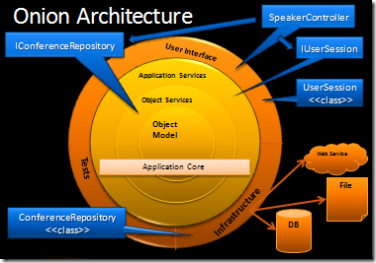
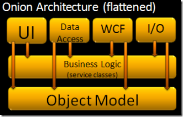

- [微服务 模式](https://azure.microsoft.com/en-us/blog/design-patterns-for-microservices/)

- [REST?RPC?是时候改变你对微服务的认知了！ ](https://mp.weixin.qq.com/s/HTeQNU-1P-hWloEdjl1QYg)

- [如何做高可用的架构设计 ](https://mp.weixin.qq.com/s?__biz=MzI3OTUwMjM4MA==&mid=2247483756&idx=1&sn=7bda8ca7926977b12d4b8fd94cc72220&chksm=eb478a2fdc30033958dc7de381c0214c1d8073e707a287d75789fba73b2dcf046dff4c68c569#rd)

- [Getting Started with Microservices](https://blogs.oracle.com/developers/getting-started-with-microservices-part-one)

- [实施微服务](http://www.infoq.com/cn/articles/basis-frameworkto-implement-micro-service)

- [微服务实战（二）：使用API Gateway ](http://dockone.io/article/482)

- [Building a Microservices Ecosystem with Kafka Streams and KSQL](https://www.confluent.io/blog/building-a-microservices-ecosystem-with-kafka-streams-and-ksql/)

### 洋葱架构

- [洋葱架构模式](http://jeffreypalermo.com/blog/the-onion-architecture-part-1/)

[存储](http://www.golangdevops.com/2017/09/05/abstracting-the-storage-layer/)

[关于洋葱架构](http://idiomaticgo.com/post/best-practice/server-project-layout/)

> [Alistair Cockburn](http://alistair.cockburn.us/index.php/Main_Page) has written a bit about Hexagonal architecture.  [Hexagonal architecture](http://alistair.cockburn.us/index.php/Hexagonal_architecture) and Onion Architecture share the following premise:  Externalize infrastructure and write adapter code so that the infrastructure does not become tightly coupled.

洋葱例子:

> Let's review Onion Architecture.  The object model is in the center with supporting business logic around it.  The direction of coupling is toward the center.  The big difference is that any outer layer can directly call any inner layer.   With traditionally layered architecture, a layer can only call the layer directly beneath it.  **This is one of the key points that makes Onion Architecture different from traditional layered architecture**
>  Infrastructure is pushed out to the edges where no business logic code couples to it.  The code that interacts with the database will implement interfaces in the application core.  The application core is coupled to those interfaces but not the actual data access code.  In this way, we can change code in any outer layer without affecting the application core.  We include tests because any long-lived application needs tests.  Tests sit at the outskirts because the application core doesn't couple to them, but the tests are coupled to the application core.  We could also have another layer of tests around the entire outside when we test the UI and infrastructure code.

平面化：

>   Onion Architecture would look like when represented as a traditionally layered architecture.  The big difference is that Data Access is a top layer along with UI, I/O, etc.  Another key difference is that the layers above can use any layer beneath them, not just the layer immediately beneath.  Also, business logic is coupled to the object model but not to infrastructure.

传统层式架构 中心化表示:

>   The big kicker here is that we clearly see the application is built around data access and other infrastructure.  Because the application has this coupling, when data access, web services, etc. change, the business logic layer will have to change.  The world view difference is how to handle infrastructure.  Traditional layered architecture couples directly to it.  Onion Architecture pushes it off to the side and defines abstractions (interfaces) to depend on.  Then the infrastructure code also depends on these abstractions (interfaces).  Depending on abstractions is an old principle, but the Onion Architecture puts that concepts right up front. 

### 主要优点：

Key tenets of Onion Architecture:

-    The application is built around an independent object model
-    Inner layers define interfaces.  Outer layers implement interfaces
- Direction of coupling is toward the center
-    All application core code can be compiled and run separate from infrastructure

##  六边形架构
[hexagonal-architecture](http://fideloper.com/hexagonal-architecture)

[Cleaning up your codebase with a clean architecture](https://dev.to/barryosull/cleaning-up-your-codebase-with-a-clean-architecture)

[Applying The Clean Architecture to Go applications](http://manuel.kiessling.net/2012/09/28/applying-the-clean-architecture-to-go-applications/)

[Clean Architecture using Golang](https://medium.com/@eminetto/clean-architecture-using-golang-b63587aa5e3f)

[golang-clean-archithecture](https://hackernoon.com/golang-clean-archithecture-efd6d7c43047)
[Go (Golang) Clean Architectur](https://github.com/bxcodec/go-clean-arch)

[user-manager follow the hexagonal/clean architecture](https://github.com/cgarvis/citizens)

[Putting the Clean Architecture into practice](https://geeks.uniplaces.com/putting-clean-architecture-into-practice-20c47d8c76de)

[Applying The Clean Architecture to Go applications](http://manuel.kiessling.net/2012/09/28/applying-the-clean-architecture-to-go-applications/)

[Architecting Android...The clean way?](https://fernandocejas.com/2014/09/03/architecting-android-the-clean-way/)
[Android MVP: What is an Interactor?](https://stackoverflow.com/questions/35746546/android-mvp-what-is-an-interactor)

[Layers, Onions, Ports, Adapters 我们都一样](http://blog.ploeh.dk/2013/12/03/layers-onions-ports-adapters-its-all-the-same/)

[Cleaning up your codebase with a clean architecture](https://dev.to/barryosull/cleaning-up-your-codebase-with-a-clean-architecture)

[How to Organize CLEAN ARCHITECTURE to Modular Patterns in 10 Minutes](https://hackernoon.com/applying-clean-architecture-on-web-application-with-modular-pattern-7b11f1b89011)
用例图不错！

>
    在传统mvc架构中 某个action中的代码 感觉就像混合了多个国家人的讨论会 要不断的切换不同方言对不同国别的人交谈
> Storing and retrieving things is clearly the repository pattern. So let's create two new application concepts, UserRepository and ImageRepository, and we'll implement them as interfaces.    

[领域模型 对底层持久和orm是无感知的](https://medium.com/@johnkevinmbasco/domain-models-that-are-100-ignorant-of-persistence-and-orm-unaware-d8f7a8253c7b)

[Improve Your Software Architecture with Ports and Adapters](https://spin.atomicobject.com/2013/02/23/ports-adapters-software-architecture/)
[Hexagonal Architecture in Action](https://spin.atomicobject.com/2017/11/21/hexagonal-architecture/)

[Functional architecture is Ports and Adapters by Mark Seemann](http://blog.ploeh.dk/2016/03/18/functional-architecture-is-ports-and-adapters/)

[Clean Architecture with MVVMi, Architecture Components & RxJava](https://medium.com/@thereallukesimpson/clean-architecture-with-mvvmi-architecture-components-rxjava-8c5093337b43)

[视频 资料收集](https://medium.com/@johnkevinmbasco/domain-models-that-are-100-ignorant-of-persistence-and-orm-unaware-d8f7a8253c7b)

### 一些实现

- [go cleanarch](https://github.com/moul/cleanarch)
- [clean-go](https://github.com/CaptainCodeman/clean-go)
- [user management and authentication clean-go](https://github.com/cgarvis/citizens)
- [go-cleanarchitecture](https://github.com/manuelkiessling/go-cleanarchitecture)

- [java ](https://github.com/xpmatteo/birthday-greetings-kata)

- [辅助实现](https://github.com/dadamssg/commandbus)

### 涉及到 hexagonal/onoin/clean architecture 的书：

- <<Dependency Injection in .NET>>

### 涉及到DCI架构的书

- << Lean Architecture for Agile Software Development >>

### 测试驱动

- << Growing Object Oriented Software, Guided by Tests >>